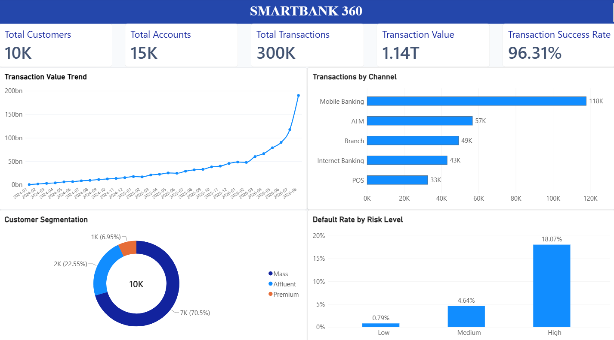
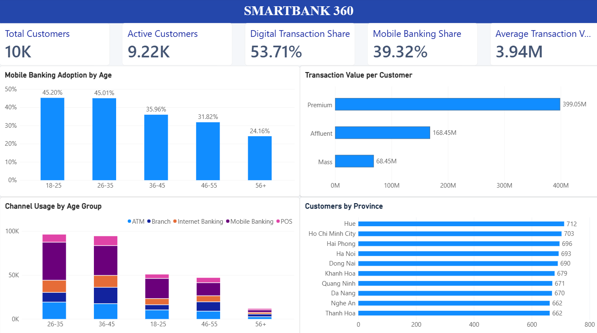
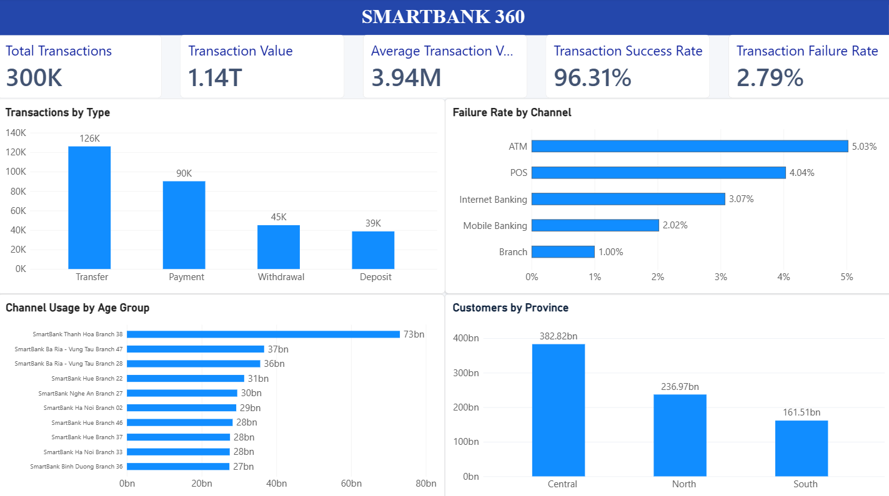
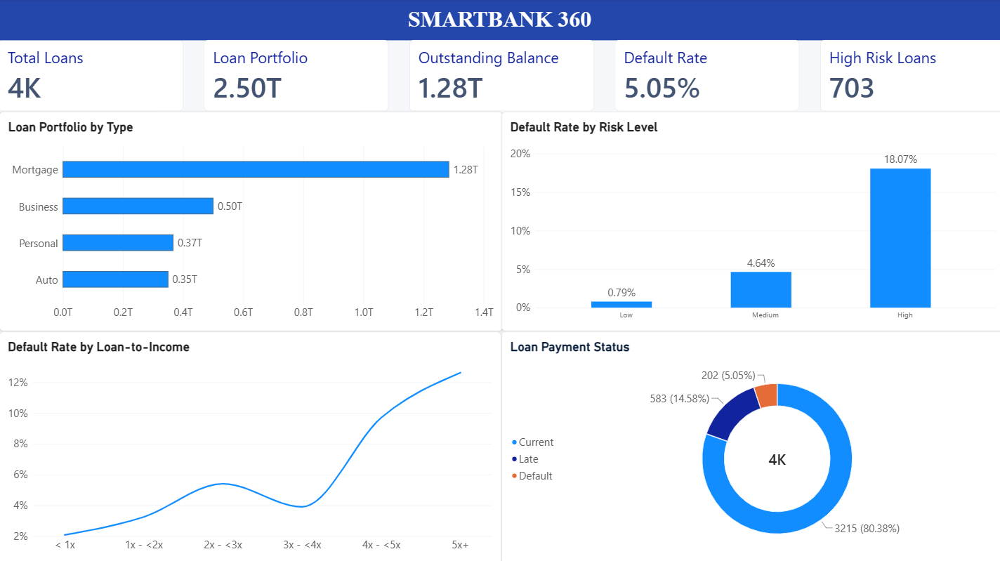

# SmartBank 360
## Banking Customer, Transaction & Credit Risk Analytics

SmartBank 360 is an end-to-end banking data analytics portfolio project built using PostgreSQL, Python, SQL, Power BI, Power Query and DAX.

The project simulates a banking analytics environment to analyze customer behavior, transaction performance, digital banking adoption, branch performance, loan portfolio and credit risk.

> Note: All data used in this project is synthetic and generated for educational and portfolio purposes. It does not represent any real bank or real customer information.

# 1. Business Problem

A bank operates across multiple branches and serves customers through different banking channels such as Mobile Banking, Internet Banking, ATM, POS and physical branches.

Management needs a centralized analytics solution to answer questions such as:

- How many customers and accounts does the bank have?
- Which transaction channels are used the most?
- Which customer segments generate the highest transaction value?
- How does digital banking adoption vary by age?
- Which branches and regions generate the highest transaction value?
- What is the transaction success and failure rate?
- How large is the loan portfolio?
- Which borrowers or loan groups show higher credit risk?
- How does Loan-to-Income relate to default risk?

SmartBank 360 was developed to answer these questions using an end-to-end data analytics workflow.

# 2. Project Architecture

Python
   ↓
Synthetic Banking Data
   ↓
CSV Files
   ↓
PostgreSQL
   ↓
SQL Analysis
   ↓
Power BI
   ↓
Power Query + Data Model + DAX
   ↓
Interactive Banking Dashboard   

# 3. Technology Stack

| Technology | Purpose |
|---|---|
| PostgreSQL | Relational database and data storage |
| pgAdmin 4 | PostgreSQL database management and SQL execution |
| Python | Synthetic data generation and data processing |
| Pandas | Data manipulation and validation |
| NumPy | Numerical calculations and synthetic data generation |
| Faker | Synthetic customer data generation |
| psycopg2 | Python connection to PostgreSQL |
| SQL | Data querying and banking analytics |
| Power BI Desktop | Dashboard development and data visualization |
| Power Query | Data transformation and preparation |
| DAX | KPI calculations and analytical measures |
| VS Code | Project development environment |
| Git / GitHub | Version control and project portfolio |

# 4. Dataset

The project uses a synthetic banking dataset containing five main tables.

| Table | Records | Description |
|---|---:|---|
| branches | 50 | Bank branch information |
| customers | 10,000 | Customer demographic, income and segmentation data |
| accounts | 15,000 | Customer banking accounts |
| transactions | 300,000 | Banking transaction records |
| loans | 4,000 | Loan portfolio and credit risk data |

Total records: 329,050

The data was generated using Python with business rules designed to create realistic analytical patterns rather than purely random values.

Examples include:

- Premium customers generally have higher income and account balances.
- Younger customers have higher Mobile Banking adoption.
- Different banking channels have different transaction failure rates.
- Transaction values vary by customer segment.
- Loan risk is partially influenced by Loan-to-Income.
- High-risk borrowers have a higher probability of Late or Default status.

# 5. Data Model

The main relational structure is:

customers
    │
    ├── 1:N ── accounts
    │              │
    │              └── 1:N ── transactions
    │
    └── 1:N ── loans

branches
    │
    ├── 1:N ── accounts
    │
    └── 1:N ── loans

DimDate
    │
    └── 1:N ── transactions

Main relationships:

| From | To | Relationship |
|---|---|---|
| customers.customer_id | accounts.customer_id | 1:N |
| branches.branch_id | accounts.branch_id | 1:N |
| accounts.account_id | transactions.account_id | 1:N |
| customers.customer_id | loans.customer_id | 1:N |
| branches.branch_id | loans.branch_id | 1:N |
| DimDate.Date | transactions.Transaction Date | 1:N |

The Power BI model uses single-direction relationships to maintain a clean analytical model and avoid ambiguous filtering.

# 6. Key Banking KPIs

The dashboard calculates major banking KPIs using DAX.

| KPI | Result |
|---|---:|
| Total Customers | 10,000 |
| Active Customers | 9,218 |
| Total Accounts | 15,000 |
| Total Transactions | 300,000 |
| Transaction Value | ~1.14T VND |
| Average Transaction Value | ~3.94M VND |
| Transaction Success Rate | 96.31% |
| Total Loans | 4,000 |
| Loan Portfolio | ~2.50T VND |
| Outstanding Balance | ~1.28T VND |
| Default Loans | 202 |
| Default Rate | 5.05% |
| High Risk Loans | 703 |

Additional analytical measures include:

- Previous Month Transaction Value
- Month-over-Month Transaction Growth
- Digital Transactions
- Digital Transaction Share
- Mobile Transactions
- Mobile Banking Share
- Transaction Value per Customer
- Failed Transactions
- Transaction Failure Rate

# 7. SQL Analysis

PostgreSQL was used to validate the dataset and perform analytical queries before dashboard development.

The SQL analysis covers:

- Customer segmentation
- Customer value analysis
- Transaction volume and transaction value
- Monthly transaction trends
- Month-over-Month growth
- Banking channel performance
- Transaction success and failure rates
- Customer age and digital banking behavior
- Branch performance
- Regional transaction performance
- Loan portfolio analysis
- Default rate analysis
- Risk-level analysis
- Loan-to-Income analysis
- Customer segment and loan type analysis

SQL techniques used in the project include:

SELECT
WHERE
GROUP BY
HAVING
ORDER BY
INNER JOIN
LEFT JOIN
CASE WHEN
FILTER
CTE
DATE_TRUNC
EXTRACT
NULLIF
LAG
Window Functions
PARTITION BY

# 8. Power BI Dashboard

The Power BI report contains four analytical pages.

## Page 1 — Executive Overview

This page provides a high-level overview of overall banking performance.

Main KPIs:

- Total Customers
- Total Accounts
- Total Transactions
- Transaction Value
- Transaction Success Rate

Main visuals:

- Transaction Value Trend
- Transactions by Channel
- Customer Segmentation
- Default Rate by Risk Level

## Page 2 — Customer & Digital Banking

This page focuses on customer behavior, customer value and digital banking adoption.

Main KPIs:

- Total Customers
- Active Customers
- Digital Transaction Share
- Mobile Banking Share
- Average Transaction Value

Main visuals:

- Mobile Banking Adoption by Age
- Transaction Value per Customer Segment
- Channel Usage by Age Group
- Customers by Province

## Page 3 — Transaction & Branch Performance

This page analyzes transaction behavior, banking channels and branch performance.

Main KPIs:

- Total Transactions
- Transaction Value
- Average Transaction Value
- Transaction Success Rate
- Transaction Failure Rate

Main visuals:

- Transactions by Type
- Failure Rate by Channel
- Top 10 Branches by Transaction Value
- Transaction Value by Region

## Page 4 — Loan & Credit Risk

This page focuses on lending performance and credit risk analysis.

Main KPIs:

- Total Loans
- Loan Portfolio
- Outstanding Balance
- Default Rate
- High Risk Loans

Main visuals:

- Loan Portfolio by Type
- Default Rate by Risk Level
- Default Rate by Loan-to-Income
- Loan Payment Status

# 9. Key Insights

## 9.1 Customer Segmentation

The customer base is distributed approximately as follows:

| Segment | Customers |
|---|---:|
| Mass | 7,050 |
| Affluent | 2,255 |
| Premium | 695 |

Although Premium customers represent only a small percentage of the total customer base, they generate substantially higher transaction value per customer.

Approximate transaction value per customer:

| Segment | Transaction Value per Customer |
|---|---:|
| Mass | ~68M VND |
| Affluent | ~168M VND |
| Premium | ~399M VND |

Transaction frequency is relatively similar across customer segments.

This suggests that the difference in customer value is driven mainly by transaction size rather than transaction frequency.

## 9.2 Digital Banking Adoption

Mobile Banking is the largest transaction channel.

Transaction distribution:

| Channel | Transactions | Share |
|---|---:|---:|
| Mobile Banking | 117,965 | 39.32% |
| ATM | 56,769 | 18.92% |
| Branch | 49,380 | 16.46% |
| Internet Banking | 43,166 | 14.39% |
| POS | 32,720 | 10.91% |

Mobile Banking and Internet Banking together represent approximately 53.71% of all transactions.

Mobile Banking usage generally decreases with customer age.

Approximate Mobile Banking share by age group:

| Age Group | Mobile Banking Share |
|---|---:|
| 18–25 | ~45% |
| 26–35 | ~45% |
| 36–45 | ~36% |
| 46–55 | ~32% |
| 56+ | ~27% |

This suggests stronger digital banking adoption among younger customers in the simulated dataset.

## 9.3 Transaction Performance

The dataset contains:

300,000 transactions

Successful transaction value:

~1.14 trillion VND

Average successful transaction value:

~3.94 million VND

Overall transaction success rate:

96.31%

Transaction failure rates vary by channel.

In the simulated dataset, ATM transactions have a higher failure rate compared with Mobile Banking and Branch transactions.

## 9.4 Credit Risk

The loan portfolio contains:

4,000 loans

Total loan portfolio:

~2.50 trillion VND

Outstanding balance:

~1.28 trillion VND

Overall default rate:

5.05%

Default rate by risk level:

| Risk Level | Loans | Default Rate |
|---|---:|---:|
| Low | 2,026 | 0.79% |
| Medium | 1,271 | 4.64% |
| High | 703 | 18.07% |

The High Risk group has a significantly higher default rate than the Low and Medium Risk groups.

## 9.5 Loan-to-Income Analysis

Loan-to-Income is calculated as:
Loan Amount / Annual Income
Default rate by Loan-to-Income group:

| Loan-to-Income | Loans | Default Rate |
|---|---:|---:|
| < 1x | 1,213 | 2.80% |
| 1x - <2x | 1,248 | 3.29% |
| 2x - <3x | 408 | 5.15% |
| 3x - <4x | 439 | 4.56% |
| 4x - <5x | 419 | 10.74% |
| 5x+ | 273 | 15.02% |

Default risk generally increases as Loan-to-Income increases.

The strongest increase appears when Loan-to-Income exceeds approximately 4x annual income.

This variable could later be used as an input feature in a Machine Learning credit risk model.

# 10. Project Workflow

The project was developed using the following workflow:

1. Define banking business requirements
        ↓
2. Design relational database
        ↓
3. Generate synthetic banking data with Python
        ↓
4. Import data into PostgreSQL
        ↓
5. Validate data quality
        ↓
6. Perform SQL exploratory analysis
        ↓
7. Connect PostgreSQL to Power BI
        ↓
8. Transform data using Power Query
        ↓
9. Build relational data model
        ↓
10. Create DAX measures
        ↓
11. Build interactive dashboards
        ↓
12. Generate business insights

# 11. Project Structure

Data_AI_Banking/
│
├── data/
│   └── raw/
│       ├── branches.csv
│       ├── customers.csv
│       ├── accounts.csv
│       ├── transactions.csv
│       └── loans.csv
│
├── database/
│   ├── import_data.py
│   └── queries/
│
├── python/
│   └── generate_data.py
│
├── powerbi/
│   └── SmartBank360.pbix
│
├── images/
│   ├── 01_executive_overview.png
│   ├── 02_customer_digital_banking.png
│   ├── 03_transaction_branch_performance.png
│   └── 04_loan_credit_risk.png
│
├── docs/
│
├── .gitignore
│
└── README.md

# 12. Skills Demonstrated

This project demonstrates practical experience with:

- PostgreSQL database design
- Relational database modeling
- SQL data analysis
- Data cleaning and validation
- Python data generation
- Pandas and NumPy
- PostgreSQL integration with Python
- Power Query
- Power BI data modeling
- DAX measures
- KPI development
- Dashboard design
- Customer analytics
- Digital banking analytics
- Transaction analytics
- Branch performance analysis
- Loan portfolio analysis
- Credit risk analysis
- Business insight generation
- AI-assisted coding and analytics workflow

# 13. AI-Assisted Development

AI tools were used as a productivity assistant during development.

AI supported tasks such as:

- Generating and reviewing Python code
- Supporting SQL query development
- Debugging technical errors
- Assisting with DAX formulas
- Explaining data analysis concepts
- Improving dashboard structure

However, business requirements, data model design, validation, analytical logic and interpretation of results were reviewed and implemented as part of the project workflow.

# 14. Future Improvements

Future versions of SmartBank 360 could extend the project into more advanced Data Science and AI use cases.

Potential improvements include:

- Customer churn prediction
- Credit default prediction
- Fraud detection
- Transaction anomaly detection
- Customer Lifetime Value
- RFM customer segmentation
- Credit scoring models
- Loan repayment history analysis
- Feature engineering for credit risk
- Machine Learning risk scoring
- Explainable AI for credit decisions
- Automated ETL pipelines
- Data warehouse implementation
- Real-time transaction monitoring

# 15. Disclaimer

SmartBank 360 is an educational portfolio project.

All customers, transactions, accounts, branches and loan records are synthetically generated.

The project does not contain confidential banking information, real customer information or data from any real financial institution.

All analytical findings apply only to the simulated dataset used in this project.

# SmartBank 360

PostgreSQL + Python + SQL + Power BI + DAX

Banking Data Analytics | Customer Analytics | Digital Banking | Transaction Analytics | Credit Risk